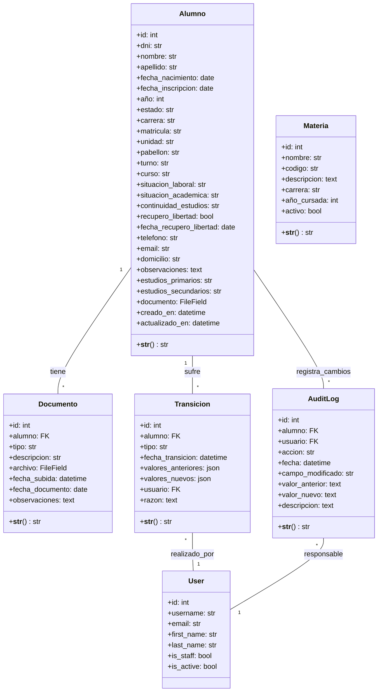
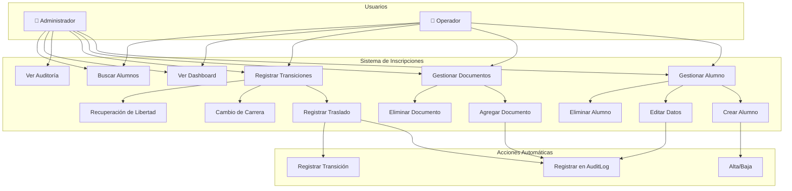
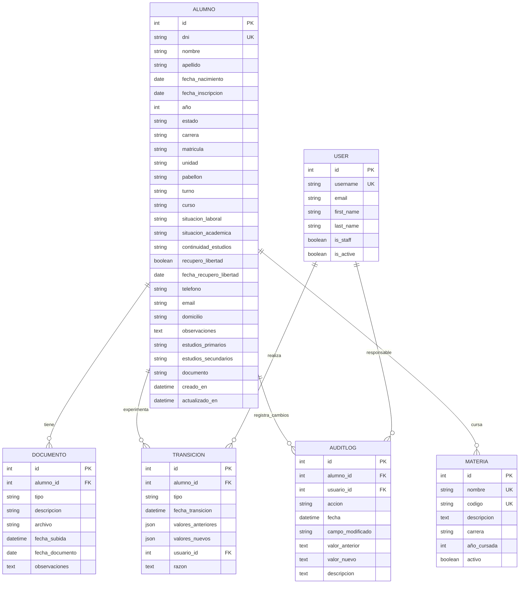
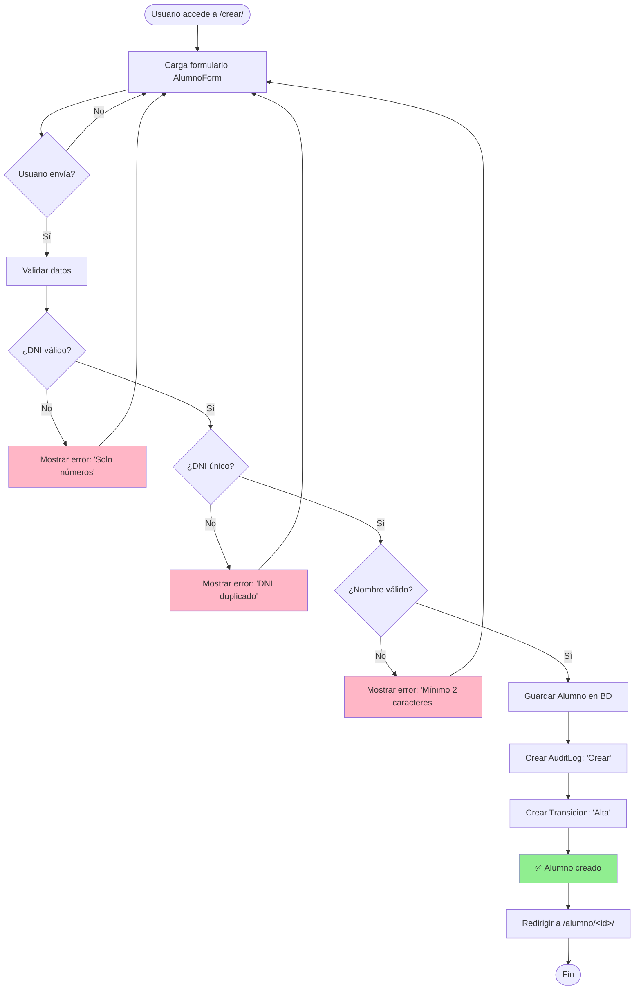
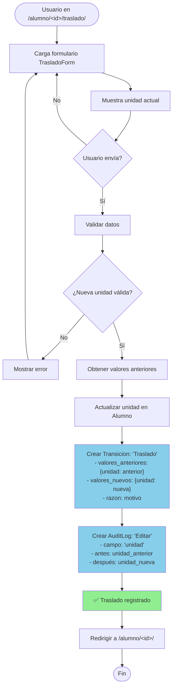
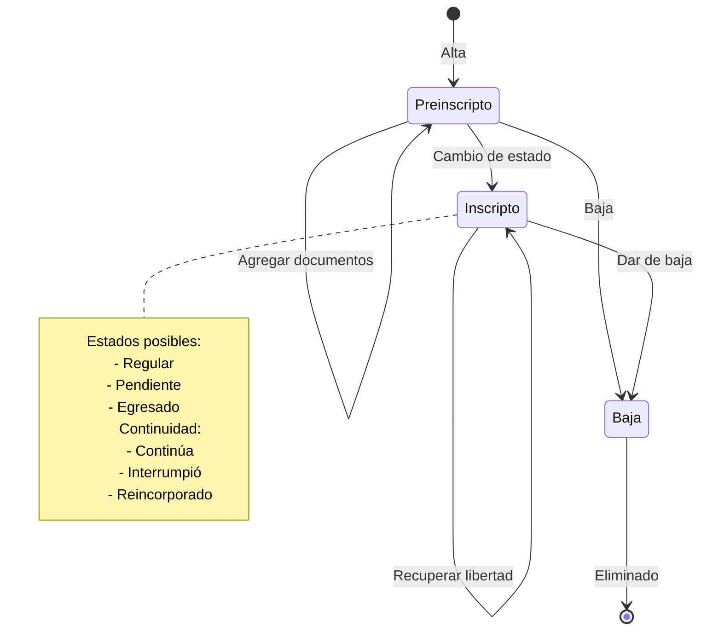
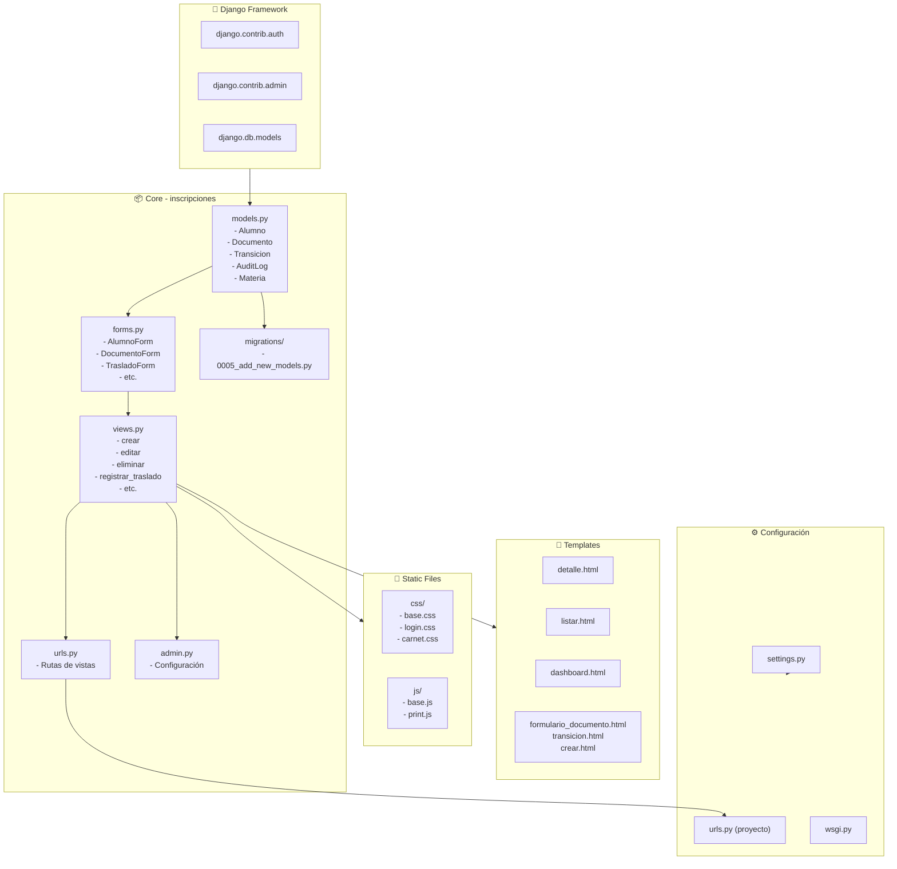
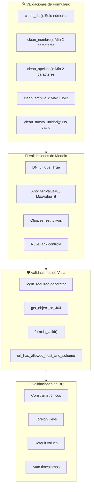

# Diagramas UML - Sistema de Gestión de Inscripciones

## 1. Diagrama de Clases (Modelo de Datos)



---

## 2. Diagrama de Casos de Uso



---

## 3. Diagrama de Relaciones de Base de Datos (ER)



---

## 4. Diagrama de Flujo - Crear Alumno



---

## 5. Diagrama de Flujo - Registrar Traslado



---

## 6. Diagrama de Secuencia - Agregar Documento

```mermaid
sequenceDiagram
    participant Usuario as 👤 Usuario
    participant Vista as 🖥️ View
    participant Formulario as 📝 DocumentoForm
    participant BD as 💾 Base de Datos
    participant Archivo as 📁 FileField

    Usuario->>Vista: GET /alumno/&lt;id&gt;/documento/agregar/
    Vista->>Formulario: Crear formulario vacío
    Formulario-->>Usuario: Mostrar formulario
    
    Usuario->>Usuario: Selecciona tipo, sube archivo
    Usuario->>Vista: POST con datos + archivo
    
    Vista->>Formulario: Validar datos
    Formulario->>Formulario: Verificar tamaño ≤ 10MB
    
    alt Archivo demasiado grande
        Formulario-->>Usuario: Error: "Archivo > 10MB"
    else Datos válidos
        Vista->>BD: Crear Documento(alumno, tipo, archivo...)
        BD->>Archivo: Guardar en /media/documentacion/YYYY/MM/
        Archivo-->>BD: ✅ Guardado
        BD-->>Vista: Documento creado
        
        Vista->>BD: Crear AuditLog(alumno, 'Editar', 'documento')
        BD-->>Vista: ✅ AuditLog creado
        
        Vista-->>Usuario: ✅ Documento agregado
        Vista->>Usuario: Redirigir a /alumno/&lt;id&gt;/
        Usuario->>Usuario: Ver documento en lista
    end
```

---

## 7. Diagrama de Estados - Alumno



---

## 8. Diagrama de Arquitectura - Capas

```mermaid
graph TB
    subgraph Frontend
        Template["Templates HTML<br/>(detalle.html, listar.html, etc.)"]
        Static["Static Files<br/>(CSS, JS)"]
    end

    subgraph Middleware
        Auth["Authentication<br/>@login_required"]
        CSRF["CSRF Protection"]
        Middleware["Django Middleware"]
    end

    subgraph Aplicación
        View["Views<br/>(crear, editar, traslado, etc.)"]
        Form["Formularios<br/>(AlumnoForm, DocumentoForm, etc.)"]
        Function["Funciones Auxiliares<br/>(registrar_auditoria,<br/>registrar_transicion)"]
    end

    subgraph Modelos
        Alumno["Alumno"]
        Documento["Documento"]
        Transicion["Transicion"]
        AuditLog["AuditLog"]
        Materia["Materia"]
        User["User (Django)"]
    end

    subgraph Persistencia
        DB["SQLite Database<br/>(db.sqlite3)"]
        Media["Media Storage<br/>(/media/documentacion/)"]
    end

    Frontend --> Middleware
    Middleware --> Aplicación
    Aplicación --> Form
    Aplicación --> Function
    Function --> Modelos
    Form --> Modelos
    View --> Modelos
    Modelos --> DB
    Modelos --> Media
    DB -.->|Auditoría| AuditLog
    DB -.->|Transiciones| Transicion
```

---

## 9. Matriz de Responsabilidades - RACI

```
┌─────────────────────────────────────────────────────────────────┐
│ RACI: Roles y Responsabilidades en Procesos Principales          │
├─────────────────────────────────────┬──────────┬──────┬──────┬──┤
│ Actividad                           │ Admin    │ Op   │ BD   │ S │
├─────────────────────────────────────┼──────────┼──────┼──────┼──┤
│ Crear alumno                        │ R/A      │ R    │ R    │ S │
│ Editar datos                        │ R/A      │ R    │ R    │ S │
│ Eliminar alumno                     │ R/A      │ R    │ R    │ S │
│ Agregar documento                   │ A        │ R    │ R    │ S │
│ Registrar traslado                  │ A        │ R    │ R    │ S │
│ Cambio de carrera                   │ A        │ R    │ R    │ S │
│ Recuperación de libertad            │ A        │ R    │ R    │ S │
│ Ver auditoría                       │ R        │ I    │ R    │ S │
│ Backup de datos                     │ R        │      │ R    │   │
├─────────────────────────────────────┼──────────┼──────┼──────┼──┤
│ R = Responsable                                                  │
│ A = Aprobador                                                    │
│ C = Consultado                                                   │
│ I = Informado                                                    │
│ S = Soporte                                                      │
└─────────────────────────────────────────────────────────────────┘
```

---

## 10. Diagrama de Módulos - Paquetes



---

## Tipos de Validaciones Implementadas


