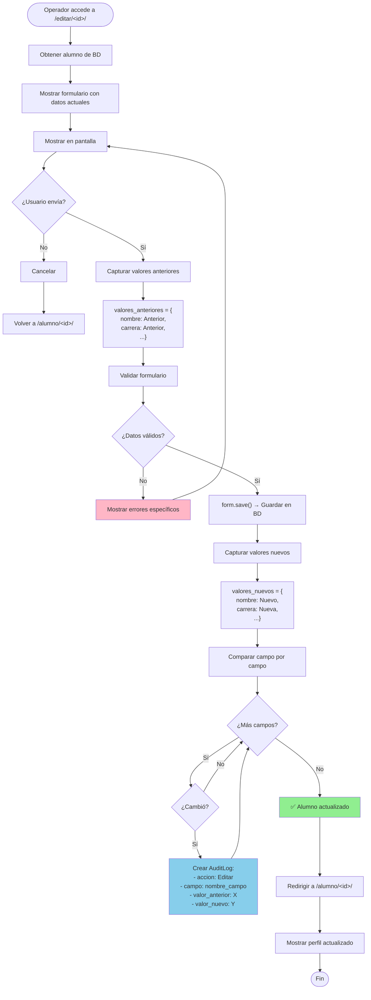
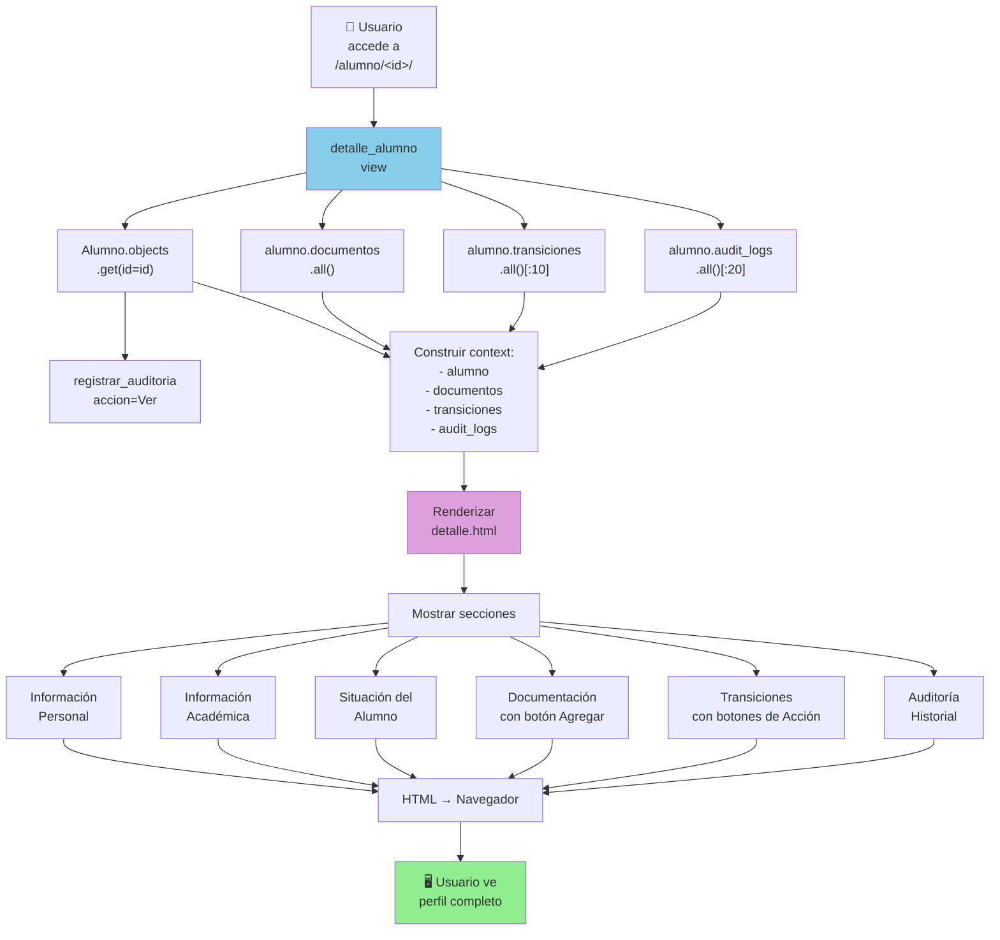
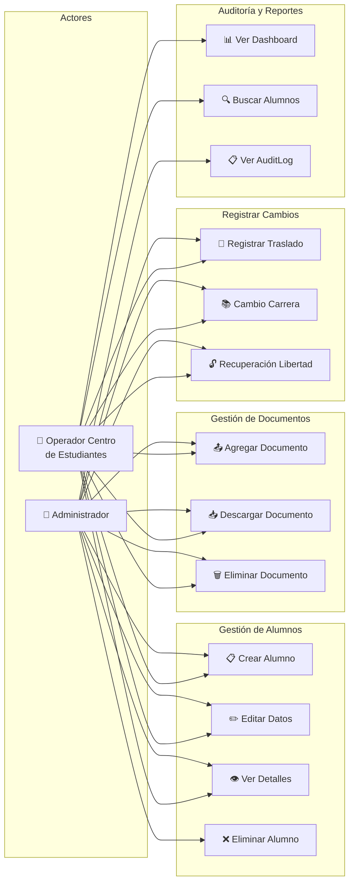
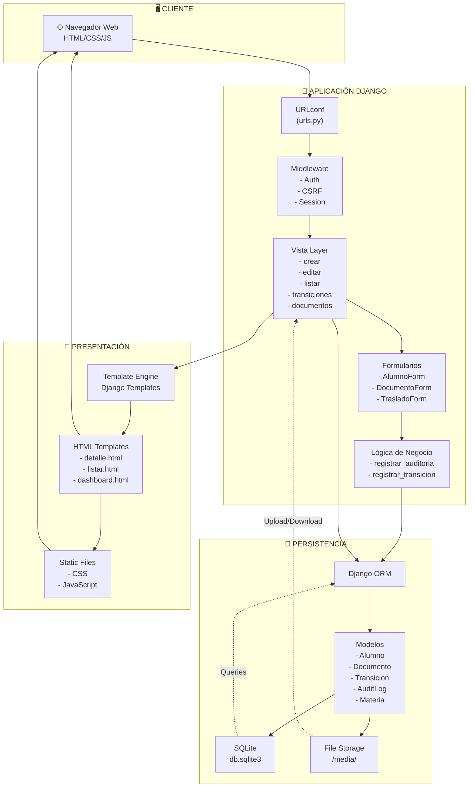
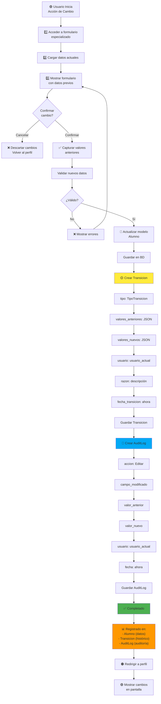
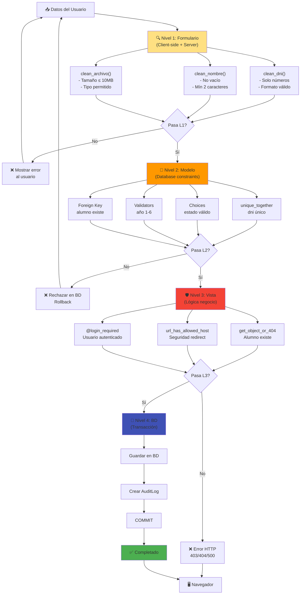
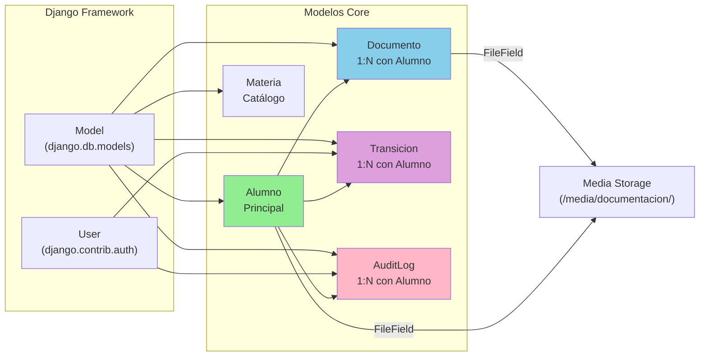

# Diagramas UML Avanzados - Sistema de Gestión de Inscripciones

## 11. Diagrama de Flujo Detallado - Editar Alumno



---

## 12. Diagrama de Interacción - Vista de Detalles



---

## 13. Mapa de Transiciones - Estado Alumno

```mermaid
stateDiagram-v2
    [*] --> CrearAlumno: POST /crear/
    
    CrearAlumno --> CapturarDatos: Validar DNI, nombre, etc.
    CapturarDatos --> GuardarBD: Crear Alumno en BD
    GuardarBD --> CrearAlta: Crear Transicion Alta
    CrearAlta --> CrearAudit: Crear AuditLog
    CrearAudit --> Preinscripto: ✅ Alumno Creado
    
    state Preinscripto {
        [*] --> PreState
        PreState --> EditarPre: /editar/&lt;id&gt;/
        EditarPre --> AuditEdit: Registrar cambios
        AuditEdit --> PreState
        PreState --> AgregarDoc: /alumno/&lt;id&gt;/documento/agregar/
        AgregarDoc --> AuditDoc: Registrar documento
        AuditDoc --> PreState
    }
    
    Preinscripto --> Inscripto: Cambiar estado
    
    state Inscripto {
        [*] --> InsState
        InsState --> Editar: /editar/&lt;id&gt;/
        InsState --> Traslado: /alumno/&lt;id&gt;/traslado/
        InsState --> CambioCarr: /alumno/&lt;id&gt;/cambio-carrera/
        InsState --> Recuperar: /alumno/&lt;id&gt;/recupero-libertad/
        InsState --> AgrDoc: /alumno/&lt;id&gt;/documento/agregar/
        
        Editar --> AuditEdit2: Registrar en AuditLog
        AuditEdit2 --> InsState
        
        Traslado --> RegTrans1: Crear Transicion Traslado
        RegTrans1 --> AuditTras: Crear AuditLog
        AuditTras --> InsState
        
        CambioCarr --> RegTrans2: Crear Transicion Cambio_Carrera
        RegTrans2 --> AuditCC: Crear AuditLog
        AuditCC --> InsState
        
        Recuperar --> RegTrans3: Crear Transicion Recupero_Libertad
        RegTrans3 --> AuditRL: Crear AuditLog
        AuditRL --> RecuperadoLib[⭐ Recuperado<br/>Libertad=True]
        RecuperadoLib --> InsState
    }
    
    Inscripto --> Baja: /eliminar/&lt;id&gt;/
    Preinscripto --> Baja: /eliminar/&lt;id&gt;/
    
    state Baja {
        [*] --> RegBaja: Crear Transicion Baja
        RegBaja --> AuditBaja: Crear AuditLog
        AuditBaja --> BajaState: Estado = Baja
    }
    
    Baja --> [*]: Eliminado
    
    note right of Preinscripto
        AuditLog registra:
        - Cada edición
        - Cada documento
        - Cada visualización
    end note
    
    note right of Inscripto
        Transiciones registran:
        - Traslados (valores antes/después)
        - Cambios de carrera
        - Recuperación de libertad
    end note
```

---

## 14. Diagrama de Caso de Uso Expandido



---

## 15. Diagrama de Componentes - Arquitectura



---

## 16. Ciclo de Vida de una Transición



---

## 17. Matriz de Datos - Campos por Operación

```
┌──────────────────────────────────────────────────────────────────┐
│            CAMPOS REGISTRADOS POR TIPO DE OPERACIÓN              │
├────────────────┬───────┬─────────┬────────────┬─────────────────┤
│ OPERACIÓN      │ Model │ AuditLog│ Transicion │ Documento       │
├────────────────┼───────┼─────────┼────────────┼─────────────────┤
│ Crear          │   ✓   │    ✓    │     ✓      │       -         │
│ Editar campos  │   ✓   │    ✓    │     -      │       -         │
│ Traslado       │   ✓   │    ✓    │     ✓      │       -         │
│ Carrera        │   ✓   │    ✓    │     ✓      │       -         │
│ Libertad       │   ✓   │    ✓    │     ✓      │       -         │
│ Documento      │   -   │    ✓    │     -      │       ✓         │
│ Ver perfil     │   -   │    ✓    │     -      │       -         │
│ Eliminar       │   -   │    ✓    │     ✓      │       -         │
└────────────────┴───────┴─────────┴────────────┴─────────────────┘

Campos AuditLog:
├─ alumno_id (FK)
├─ usuario_id (FK)
├─ accion (Crear, Editar, Eliminar, Ver)
├─ fecha (AUTO: now)
├─ campo_modificado
├─ valor_anterior
├─ valor_nuevo
└─ descripcion

Campos Transicion:
├─ alumno_id (FK)
├─ tipo (8 tipos posibles)
├─ fecha_transicion (AUTO: now)
├─ valores_anteriores (JSON)
├─ valores_nuevos (JSON)
├─ usuario_id (FK)
└─ razon (text)

Campos Documento:
├─ alumno_id (FK)
├─ tipo (7 tipos)
├─ descripcion
├─ archivo (path)
├─ fecha_subida (AUTO)
├─ fecha_documento (manual)
└─ observaciones
```

---

## 18. Flujo de Validación Multinivel



---

## 19. Dependencias de Modelos



---

## 20. Tabla Comparativa - Modelos vs Funcionalidades

```
┌─────────────────────────────────────────────────────────────────┐
│       COBERTURA DE FUNCIONALIDADES POR MODELO                   │
├──────────────┬──────────┬──────────┬──────────┬────────────────┤
│ Funcionalidad│ Alumno   │ Documento│Transicion│ AuditLog       │
├──────────────┼──────────┼──────────┼──────────┼────────────────┤
│ Datos base   │ ✓✓✓      │ -        │ -        │ -              │
│ Documentación│ ✓(básica)│ ✓✓✓      │ -        │ ✓(registro)    │
│ Auditoría    │ ✓        │ -        │ -        │ ✓✓✓            │
│ Transiciones │ ✓        │ -        │ ✓✓✓      │ ✓(registro)    │
│ Timestamps   │ ✓        │ ✓        │ ✓        │ ✓              │
│ Usuario      │ -        │ -        │ ✓        │ ✓              │
│ Historia     │ ✓        │ ✓        │ ✓        │ ✓              │
│ JSON data    │ -        │ -        │ ✓        │ -              │
└──────────────┴──────────┴──────────┴──────────┴────────────────┘

Leyenda:
✓✓✓ = Rol principal
✓✓  = Rol importante
✓   = Soporte
-   = No aplica
```
